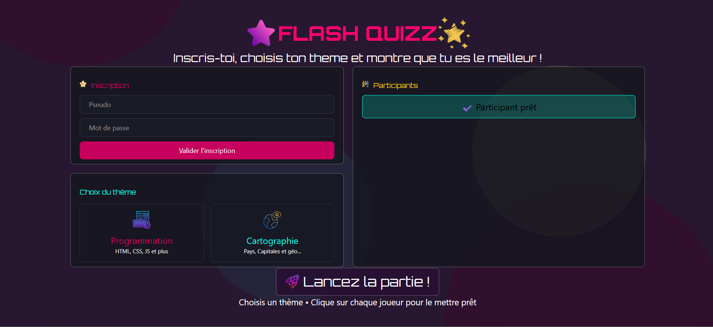

# 🎯 MiniQuizz - Plateforme de Quiz Interactif

[](https://www.php.net/)
[](https://www.mysql.com/)
[](https://tailwindcss.com/)
[](LICENSE)

Une plateforme de quiz interactive et moderne développée en **PHP orienté objet**, avec une interface utilisateur époustouflante et un système de scoring en temps réel.



## 📋 Table des matières

- [Caractéristiques](#-caractéristiques)
- [Technologies](#-technologies)
- [Architecture](#-architecture)
- [Installation](#-installation)
- [Configuration](#-configuration)
- [Utilisation](#-utilisation)
- [Structure du projet](#-structure-du-projet)
- [Base de données](#-base-de-données)
- [Contribution](#-contribution)
- [Licence](#-licence)

## ✨ Caractéristiques

- 🔐 **Système d'authentification** : Inscription et connexion sécurisées avec gestion de sessions
- 🎨 **Interface moderne** : Design époustouflant avec Tailwind CSS et animations
- ⏱️ **Chronomètre intégré** : Limite de temps pour chaque question
- 🏆 **Classement dynamique** : Suivi des scores et classement des joueurs
- 📚 **Multiples thèmes** : Quiz organisés par catégories (Géographie, Histoire, etc.)
- ❓ **Questions à choix multiples** : Interface intuitive pour sélectionner les réponses
- 💾 **Persistance des données** : Sauvegarde des scores et profils utilisateurs
- 📱 **Design responsive** : Adapté aux appareils mobiles et desktop

## 🛠️ Technologies

- **Backend** : PHP 8.0+ (Programmation Orientée Objet)
- **Base de données** : MySQL 8.0+
- **Frontend** : Tailwind CSS 4.3, HTML5, JavaScript
- **Gestionnaire de dépendances** : npm
- **Serveur** : Apache (WAMP/LAMP)

## 🏗️ Architecture

Le projet suit une architecture **Model-View-Controller (MVC)** avec les patterns :

### Couches

```
┌─────────────────────────────────────────┐
│         Couche Présentation             │
│      (public/ - Pages PHP/HTML)         │
├─────────────────────────────────────────┤
│         Couche Métier                   │
│   (src/Entities - Logique applicative)  │
├─────────────────────────────────────────┤
│       Couche Accès aux Données          │
│  (src/Repositories - CRUD Database)     │
├─────────────────────────────────────────┤
│         Base de Données                 │
│         (MySQL - Persistance)           │
└─────────────────────────────────────────┘
```

### Entités principales

- **Joueur** : Gestion des utilisateurs (pseudo, mot de passe)
- **QCM** : Quiz avec thème et description
- **Question** : Intitulé et limite de temps
- **Réponse** : Options de réponse (correct ou incorrect)
- **Score** : Enregistrement des résultats avec timestamp

## 📦 Installation

### Prérequis

- PHP 8.0 ou supérieur
- MySQL 8.0 ou supérieur
- Node.js 16+ et npm (pour Tailwind CSS)
- Apache (ou tout serveur web compatible)
- WAMP, LAMP ou Docker

### Étapes d'installation

1. **Clonez le dépôt**
```bash
git clone https://github.com/votre-username/POO-Projet-MiniQuizz.git
cd POO-Projet-MiniQuizz
```

2. **Installez les dépendances npm**
```bash
npm install
```

3. **Créez la base de données**
```bash
# Importez le fichier SQL dans phpMyAdmin ou via le CLI
mysql -u root -p < bdd/drawSQL-mysql-export-2026-06-04.sql
```

4. **Configurez la connexion à la base de données**
```bash
# Modifiez le fichier utils/db_connexion.php avec vos paramètres
nano utils/db_connexion.php
```

5. **Démarrez le serveur de développement**
```bash
# Avec Apache/WAMP
# Accédez à http://localhost/POO-Projet-MiniQuizz

# Ou avec le serveur PHP intégré
php -S localhost:8000
```

6. **Compilez les styles Tailwind CSS**
```bash
npm run build
# Ou en mode watch
npm run watch
```

## ⚙️ Configuration

### Fichier de connexion à la base de données

Mettez à jour [utils/db_connexion.php](utils/db_connexion.php) :

```php
$host = "localhost";
$user = "root";
$password = "votre_mot_de_passe";
$database = "miniquizz";
$port = 3306;
```

### Variables d'environnement (optionnel)

Créez un fichier `.env` à la racine du projet :

```env
DB_HOST=localhost
DB_USER=root
DB_PASSWORD=votre_mot_de_passe
DB_NAME=miniquizz
SESSION_TIMEOUT=3600
```

## 🎮 Utilisation

### Accueil et authentification

1. Accédez à `http://localhost/POO-Projet-MiniQuizz`
2. **Créez un compte** en cliquant sur "Inscription"
3. Remplissez le formulaire avec votre pseudo et mot de passe
4. **Connectez-vous** avec vos identifiants

### Sélectionner un quiz

1. Après connexion, visualisez la liste des thèmes disponibles
2. Cliquez sur un thème pour accéder aux questions
3. Consultez la description du quiz

### Répondre aux questions

1. Lisez la question attentivement
2. Sélectionnez votre réponse parmi les options proposées
3. Observez le chronomètre et répondez dans le délai imparti
4. Passez à la question suivante
5. Consultez votre score à la fin du quiz

### Consulter le classement

1. Accédez à la page [public/classement.php](public/classement.php)
2. Visualisez les meilleurs scores
3. Comparez vos performances

## 📁 Structure du projet

```
POO-Projet-MiniQuizz/
├── 📄 index.php                    # Point d'entrée principal
├── 📄 package.json                 # Dépendances npm
├── 📄 README.md                    # Ce fichier
│
├── 📂 _partials/                   # Composants réutilisables
│   ├── _head.php                   # En-tête HTML
│   └── _footer.php                 # Pied de page
│
├── 📂 assets/                      # Ressources statiques
│   ├── images/                     # Images et icônes
│   └── styles/
│       ├── input.css               # Styles Tailwind input
│       └── style.css               # Styles compilés
│
├── 📂 bdd/                         # Base de données
│   └── drawSQL-mysql-export-2026-06-04.sql
│
├── 📂 public/                      # Pages publiques
│   ├── index.php                   # Accueil/Sélection de thème
│   ├── questions.php               # Interface de quiz
│   └── classement.php              # Tableau des scores
│
├── 📂 process/                     # Traitements côté serveur
│   ├── traitement-inscription.php
│   ├── traitement-deconnexion.php
│   └── traitement-theme.php
│
├── 📂 src/                         # Code métier (POO)
│   ├── Entities/                   # Modèles
│   │   ├── Joueur.php
│   │   ├── Qcm.php
│   │   ├── Question.php
│   │   ├── Reponse.php
│   │   └── Score.php
│   ├── Mappers/                    # Mappage objet-relationnel
│   │   └── JoueurMapper.php
│   └── Repositories/               # Accès aux données
│       └── JoueurRepository.php
│
└── 📂 utils/                       # Fonctions utilitaires
    ├── autoloader.php              # Auto-chargement des classes
    ├── db_connexion.php            # Connexion base de données
    └── isThemeChosen.php           # Vérification du thème
```

## 💾 Base de données

### Schéma des tables

#### Table `Joueur`
```sql
CREATE TABLE Joueur (
    id BIGINT UNSIGNED NOT NULL AUTO_INCREMENT PRIMARY KEY,
    pseudo VARCHAR(255) NOT NULL UNIQUE,
    mot_de_passe VARCHAR(255) NOT NULL
);
```

#### Table `Qcm`
```sql
CREATE TABLE Qcm (
    id BIGINT UNSIGNED NOT NULL AUTO_INCREMENT PRIMARY KEY,
    theme VARCHAR(255) NOT NULL,
    description TEXT NOT NULL
);
```

#### Table `Question`
```sql
CREATE TABLE Question (
    id BIGINT UNSIGNED NOT NULL AUTO_INCREMENT PRIMARY KEY,
    intitule TEXT NOT NULL,
    tp_limite INT NOT NULL,
    qcm_id INT NOT NULL,
    FOREIGN KEY (qcm_id) REFERENCES Qcm(id)
);
```

#### Table `Reponse`
```sql
CREATE TABLE Reponse (
    id BIGINT UNSIGNED NOT NULL AUTO_INCREMENT PRIMARY KEY,
    intitule TEXT NOT NULL,
    correct_ou_non BOOLEAN NOT NULL,
    question_id INT NOT NULL,
    FOREIGN KEY (question_id) REFERENCES Question(id)
);
```

#### Table `Score`
```sql
CREATE TABLE Score (
    id BIGINT UNSIGNED NOT NULL AUTO_INCREMENT PRIMARY KEY,
    score INT NOT NULL,
    qcm_id INT NOT NULL,
    joueur_id INT NOT NULL,
    chrono DATETIME NOT NULL,
    FOREIGN KEY (qcm_id) REFERENCES Qcm(id),
    FOREIGN KEY (joueur_id) REFERENCES Joueur(id)
);
```

### Relations

```
Joueur (1) ──────────── (N) Score
Qcm (1) ──────────── (N) Question
Qcm (1) ──────────── (N) Score
Question (1) ──────────── (N) Reponse
```

## 🔒 Sécurité

- ✅ Hachage des mots de passe (bcrypt recommandé)
- ✅ Sessions PHP sécurisées
- ✅ Protection contre les injections SQL (requêtes préparées)
- ✅ Validation des données côté serveur
- ⚠️ À implémenter : CSRF tokens, HTTPS en production

## 🚀 Optimisations futures

- [ ] Ajouter la gestion des rôles (Administrateur, Joueur)
- [ ] Implémenter un système de difficulté (Facile, Moyen, Difficile)
- [ ] Ajouter des statistiques détaillées par joueur
- [ ] Historique complet des quiz passés
- [ ] API REST pour mobile
- [ ] Système de badges et récompenses
- [ ] Mode multijoueur en temps réel
- [ ] Générateur de QCM dynamique

## 🤝 Contribution

Les contributions sont bienvenues ! Pour contribuer :

1. Forkez le dépôt
2. Créez une branche pour votre feature (`git checkout -b feature/AmazingFeature`)
3. Committez vos changements (`git commit -m 'Add some AmazingFeature'`)
4. Poussez vers la branche (`git push origin feature/AmazingFeature`)
5. Ouvrez une Pull Request

## 📝 Licence

Ce projet est licencié sous la [Licence MIT](LICENSE) - consultez le fichier [LICENSE](LICENSE) pour plus de détails.

## 👨‍💻 Auteur

**Votre Nom** - [GitHub](https://github.com/votre-username)

## 📞 Support

Pour toute question ou problème, ouvrez une [issue](../../issues) sur GitHub.

---

<div align="center">
    <strong>Amusez-vous bien avec MiniQuizz ! 🎉</strong>
</div>
